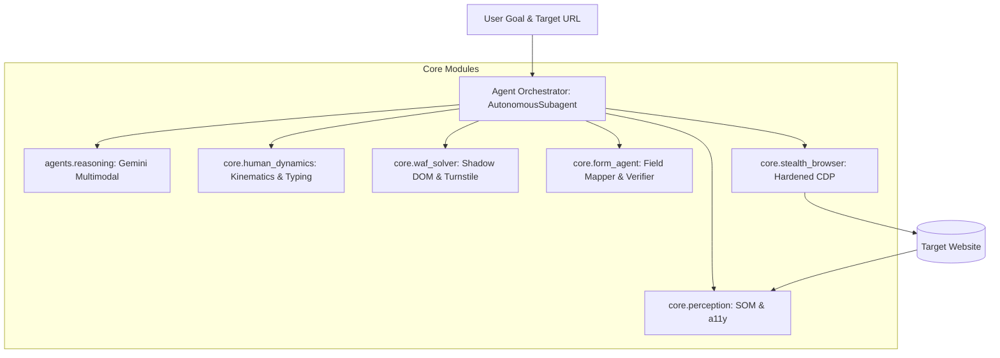

# Stealth Browser Subagent Architecture & Design Specification

---

## 1. System Architecture

The subagent is structured into decoupled, resilient pipeline modules:



---

## 2. Component Specifications

### 2.1 `core.stealth_browser`
- **Purpose**: Initializing and managing hardened browser contexts.
- **Engine Support**: `rebrowser-playwright`, `playwright`, and direct CDP connection strings.
- **Anti-Detection Defenses**:
  - Drops `--enable-automation`, `--remote-debugging-pipe`.
  - Injects `--disable-blink-features=AutomationControlled`.
  - Normalizes `navigator.webdriver`, `navigator.languages`, `navigator.plugins`.
  - Configures realistic viewport (1920x1080), device scale, and audio/canvas seeds.

### 2.2 `core.human_dynamics`
- **Mouse Kinematics (`human_move_and_click`, `human_scroll`)**:
  - Implements 3rd-order Bézier curves between arbitrary points $(x_0, y_0) \to (x_1, y_1)$.
  - Control points $(c_{x1}, c_{y1}), (c_{x2}, c_{y2})$ randomized with variance dependent on euclidean distance.
  - Adds Gaussian micro-jitter ($0.5px$) and decelerating arrival dynamics.
- **Stochastic Typing (`human_type`)**:
  - Key interval model: $\Delta t \sim \mathcal{N}(85\text{ms}, 25\text{ms})$.
  - Bounded between $30\text{ms} \le \Delta t \le 220\text{ms}$.
  - Word boundary pauses: $\Delta t_{space} \sim \mathcal{U}(150\text{ms}, 350\text{ms})$.
  - Simulated typos and backspace corrections at a $1.5\%$ probability threshold.

### 2.3 `core.perception`
- **Set-of-Marks (SOM)**:
  - Scans active viewport for interactive elements (`input`, `textarea`, `select`, `button`, `[role="button"]`, `a`).
  - Injects non-intrusive, numbered badge overlays with distinct bounding boxes.
  - Captures full-resolution viewport screenshot.
- **Accessibility (a11y) Extraction**:
  - Generates a pruned JSON tree of element labels, placeholder texts, ARIA attributes, and assigned mark IDs.

### 2.4 `core.waf_solver`
- **Challenge Detection**: Continuously monitors for Cloudflare challenge patterns (`challenges.cloudflare.com`, `#turnstile-wrapper`, `challenge-stage`, `DataDome` frames).
- **Shadow DOM Traversal**:
  - Recursively searches nested `shadowRoot` trees.
  - Queries closed shadow boundaries for checkbox triggers.
  - Obtains real viewport coordinates and delegates to `human_move_and_click`.

### 2.5 `core.form_agent`
- **Semantic Field Mapping**: Automatically maps arbitrary form fields (e.g. "Full Name", "Company Email", "Phone", "Zip Code") to provided data objects using fuzzy key matching and LLM schema validation.
- **Field Type Handlers**:
  - Text, Password, Email, Tel.
  - Single and Multi-select Dropdowns (both native `<select>` and custom `<div>` / `<ul>` dropdowns).
  - Radio button groups and Checkbox arrays.
  - Date / Time pickers.
- **Verification Assertions**: Validates input values post-fill and captures submission confirmation screens.

---

## 3. Directory Layout

```
stealth-browser-subagent/
├── core/
│   ├── __init__.py
│   ├── stealth_browser.py     # Hardened browser launch & context isolation
│   ├── human_dynamics.py      # Bézier curves, jitter, humanized typing
│   ├── perception.py          # SOM visual injection & a11y DOM parser
│   ├── waf_solver.py          # Turnstile & closed shadow DOM solver
│   └── form_agent.py          # Form understanding & fill pipeline
├── agents/
│   ├── __init__.py
│   └── subagent.py            # Orchestrator with Gemini Multimodal reasoning
├── examples/
│   ├── __init__.py
│   └── example_navigation_and_form.py # Working end-to-end demo
├── docs/
│   ├── RESEARCH_COMPENDIUM.md # Full 2026 research documentation
│   └── ARCHITECTURE.md        # This specification
├── requirements.txt
└── README.md
```
