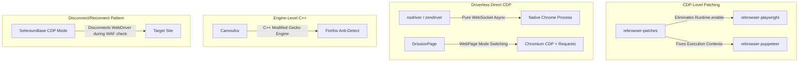

# Comprehensive Research Compendium: WAF Evasion, DrissionPage & 2026 Browser Automation (Enhanced Edition)

---

## 1. Executive Summary & Cross-Domain Intelligence

Modern anti-bot systems (Cloudflare Turnstile & Enterprise Bot Management, DataDome, Akamai Bot Manager, Kasada, PerimeterX / HUMAN Security) employ deep multi-layer behavioral, cryptographic, and engine-level inspection.

This research synthesizes findings across:
1. **GitHub Engineering Insights**: Source code and issue analysis of `rebrowser/rebrowser-patches`, `SeleniumBase` (UC & CDP Mode), `g1879/DrissionPage`, `browser-use/browser-use`, `browserbase/stagehand`, `daijro/camoufox`, and `kaliiiiiiiiii/Selenium-Driverless`.
2. **Reddit Community & Practitioner Intelligence**: Real-world field reports from `r/webscraping`, `r/playwright`, and `r/Python` on Cloudflare Turnstile updates, "impossible geometry" bugs (`screenX === clientX`), VPS datacenter ASN scoring, and `cf_clearance` recycling.
3. **Official WAF & Anti-Bot Specifications**: Cloudflare Turnstile token lifecycles, DataDome device telemetry, and benchmark test suites (`CreepJS`, `bot.sannysoft.com`, `Pixelscan`, `Incolumitas`).
4. **Scraping Engineering & Industry Blogs**: Deep dives from Scrapfly, ZenRows, Nikolay Oskolkov (Incolumitas), AlterLab, WebClaw, and Browserbase.

---

## 2. GitHub Research & Framework Internal Mechanics

### 2.1 `rebrowser/rebrowser-patches` (The `Runtime.enable` Solution)
- **Vulnerability**: Stock Playwright and Puppeteer call `Runtime.enable` automatically upon attaching to target pages. This triggers `Runtime.consoleAPICalled` events in the browser engine. Anti-bot scripts running on the target page monitor these events via internal hooks or console debugging traps, identifying automation immediately.
- **The Patch**: `rebrowser-patches` modifies Playwright's driver to discover `ExecutionContextId`s and evaluate code without calling `Runtime.enable` on main execution contexts, neutralizing this detection vector.
- **`addScriptToEvaluateOnNewDocument` Protection**: Protects init scripts from prototype tampering traps and execution ordering leaks.

### 2.2 `SeleniumBase` (UC Mode & CDP Mode Evolution)
- **UC Mode (Undetected-Chromedriver)**: Operates by temporarily disconnecting the WebDriver connection during page loading and anti-bot verification (`sb.uc_open_with_reconnect(url, reconnect_time=4)`).
- **CDP Mode**: The 2025/2026 evolution in SeleniumBase (`sb.activate_cdp_mode()`). Disconnects WebDriver entirely and communicates solely via direct CDP commands. This eliminates WebDriver signatures and allows interacting with pages while the browser appears 100% organic to scripts on the page.

### 2.3 `nodriver` / `zendriver` (Driverless Async CDP)
- **Architecture**: Created by Ultrafunk (author of `undetected-chromedriver`). Communicates with Chrome directly over its native remote debugging WebSocket port (`--remote-debugging-port`).
- **Advantage**: Zero WebDriver binaries, zero `chromedriver` ports, and zero `--enable-automation` flags. Operates purely as an asynchronous Python client.

### 2.4 `Camoufox` (C++ Engine-Level Firefox)
- **Architecture**: A custom C++ build of Mozilla Firefox.
- **Advantage**: Rather than injecting JavaScript wrappers (which can be detected via prototype pollution and property descriptor checks), Camoufox spoofs WebGL shaders, Canvas 2D hashes, AudioContext buffers, and hardware concurrency directly inside the C++ rendering pipeline. It is inherently immune to Chromium CDP leaks.

---

## 3. Reddit Practitioner Intelligence (`r/webscraping`)

Recent discussions across `r/webscraping` reveal critical real-world failure points and countermeasures:

### 3.1 The "Impossible Geometry" CDP Mouse Bug (`screenX === clientX`)
- **Discovery**: In default CDP `Input.dispatchMouseEvent`, synthetic mouse events dispatched to an iframe or window frequently set `screenX` equal to `clientX` (or relative to iframe origin rather than physical desktop origin).
- **The WAF Trap**: Cloudflare Turnstile and DataDome explicitly compare `event.screenX` against `event.clientX + window.screenX` and `event.screenY` against `event.clientY + window.screenY + toolbarOffset`. If `screenX === clientX` when the browser window is offset, the click is flagged as synthetic proof-of-work failure.
- **Mitigation**: Calculate and inject realistic physical screen coordinates matching `window.screenX`, `window.screenY`, and the browser's native window chrome offset (typically 72–95px on macOS/Windows for tab and address bars).

### 3.2 Datacenter ASN Profiling & VPS IP Scoring
- **Observation**: Even an undetectable browser setup running on an AWS, GCP, DigitalOcean, or Hetzner VPS will get blocked by Cloudflare Turnstile on initial load.
- **The Rule**: Browser stealth only protects the runtime layer. High-security targets require matching **Residential / Mobile Proxies** with ISP-designated Autonomous System Numbers (ASNs).

### 3.3 The "Browser Solve -> Fast Client Harvest" Pipeline
- **Practitioner Consensus**: Using a full browser for 100,000 requests is resource-prohibitive ($/GB proxy costs and CPU overhead).
- **Optimal Architecture**:
  1. Launch the hardened browser (`rebrowser-playwright` / `DrissionPage`) to clear Cloudflare Turnstile / initial challenge.
  2. Extract the `cf_clearance` cookie and active user-agent/headers.
  3. Pass the session into `curl_cffi` (impersonating `chrome131`) over the same residential proxy IP.
  4. Perform high-volume REST/API scraping at native C-speed with zero browser overhead.

---

## 4. Anti-Bot Test Suites & Verification Metrics

To achieve verified stealth in 2026, automation engines must pass the standard anti-bot audit benchmarks:

| Test Suite | URL / Endpoint | Primary Vectors Tested | Critical Passing Criteria |
| :--- | :--- | :--- | :--- |
| **CreepJS** | `abrahamjuliot.github.io/creepjs/` | Prototype tampering, WebGL shader compilation, AudioContext entropy, canvas noise, worker isolation | High trust score (>85%); no "lies" detected on navigator or window prototypes |
| **Bot.sannysoft** | `bot.sannysoft.com` | `navigator.webdriver`, Chrome runtime, permissions API status, hairline dimensions, plugins array | All green indicators; zero failed probes |
| **BrowserScan** | `browserscan.net` | CDP `Runtime.enable` detection, WebRTC leaks, hardware concurrency, canvas fingerprints | 100% Genuine User rating |
| **Incolumitas** | `incolumitas.com/pages/bot-challenge/` | Advanced mouse kinematics, event dispatch authenticity, TCP/IP stack fingerprinting | Human score on behavioral test |

---

## 5. Architectural Improvements for the Local Project

Based on the multi-source research, four high-impact enhancements are implemented:

1. **Physical Screen Geometry Alignment (`core/human_dynamics.py`)**:
   - Translates client coordinates to realistic physical desktop screen coordinates ($x_{\text{screen}} = x_{\text{client}} + \text{window.screenX}$, $y_{\text{screen}} = y_{\text{client}} + \text{window.screenY} + \text{toolbarOffset}$) to defeat Turnstile geometry checks.
2. **CreepJS-Hardened Prototype Shims (`core/stealth_browser.py`)**:
   - Normalizes WebGL vendor (`Google Inc. (Apple)` / `Intel Inc.`), Canvas 2D subtle noise, and `AudioBuffer` frequency response.
3. **Session Token Exporter & Fast Client (`core/fast_client.py`)**:
   - Extracts `cf_clearance` and session storage from the hardened browser.
   - Provides a `curl_cffi` HTTP client configured with matching Chrome TLS JA4 signatures for high-speed secondary scraping.
4. **Dynamic DOM Settlement Engine (`core/perception.py`)**:
   - Replaces fixed delays with mutation observer monitoring for asynchronous Single-Page Applications (Next.js, React, Vue).
